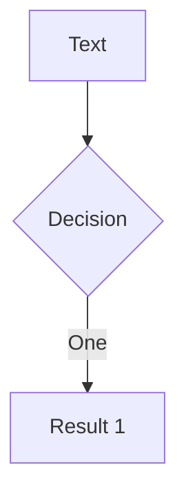
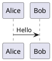

# Markdown Syntax

Source: package `template.md`, shipped skill references, and
https://sli.dev/guide/syntax.

## Slide separators

`---` with blank lines around it separates slides:

```md
# Slide 1

Content

---

# Slide 2

More content
```

The first frontmatter block is the headmatter (deck-wide config).
Any later frontmatter block configures only that slide. See [config.md](config.md).

## Presenter notes

The last HTML comment of a slide becomes its note, visible in presenter mode:

```md
# My Slide

Content

<!--
Remember to demo the feature.
-->
```

## Code blocks

Standard fenced code with Shiki highlighting; features go in curly braces:

````md
```ts {2,3}
const a = 1
const b = 2
```
````

Details (Monaco, Magic Move, twoslash, imported snippets): [code-blocks.md](code-blocks.md).

## LaTeX math

Inline `$E = mc^2$`; block with `$$ ... $$`. Clicks work inside block math:

```md
$$ {1|3|all}
\frac{-b \pm \sqrt{b^2 - 4ac}}{2a}
$$
```

## Diagrams

Mermaid and PlantUML fences render as diagrams; options in braces:

````md



````

PlantUML renders via `plantUmlServer` (default `https://www.plantuml.com/plantuml`, configurable in headmatter).

## Comark syntax

Enable in headmatter with `comark: true`, then use attribute syntax:

```md
[styled text]{style="color:red"}
{width=500px}
::component{prop="value"}
```

Code groups (`::code-group`) also require `comark: true`. See [code-blocks.md](code-blocks.md).

## Embedded styles and Vue

A `<style>` block in a slide is scoped to that slide:

```md
# Red Title

<style>
h1 { color: red; }
</style>
```

Slides accept arbitrary HTML and Vue syntax, including
`<script setup>` blocks that only affect the current slide.
UnoCSS utility classes work everywhere (the CSS engine is UnoCSS).

## Importing slides

Split a deck across files with `src` frontmatter:

```md
---
src: ./pages/intro.md
---
```

Import specific slides by number:

```md
---
src: ./other.md#2,5-7
---
```

Imported slides keep their own frontmatter; the main entry's headmatter wins on conflict.
Slides imported via `src:` are edited in their own file (matters for MCP moves).

## Icons

Any Iconify collection works as auto-imported components after installing it:

```bash
pnpm add @iconify-json/mdi
```

```md
<mdi-account-circle class="text-3xl text-red-400" />
```

Browse collections at https://icones.js.org/. `@iconify-json/carbon`,
`@iconify-json/ph`, and `@iconify-json/svg-spinners` ship as dependencies of the CLI.
